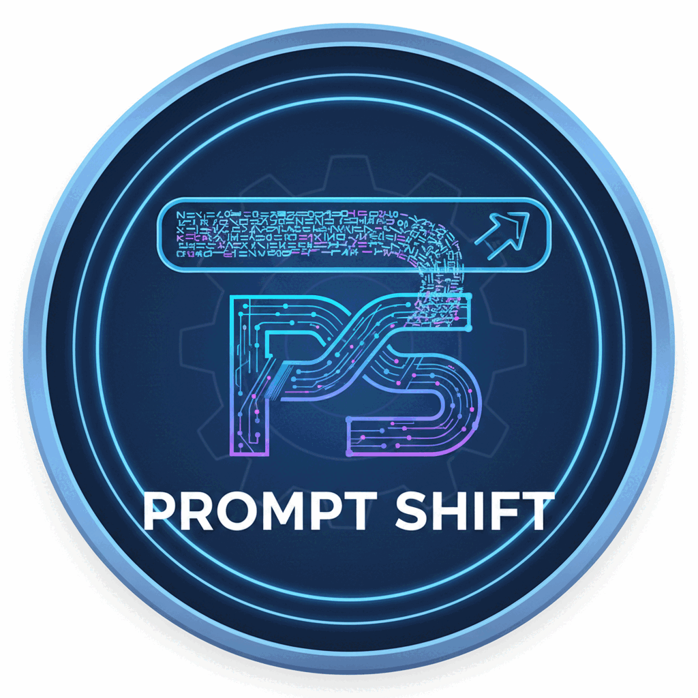
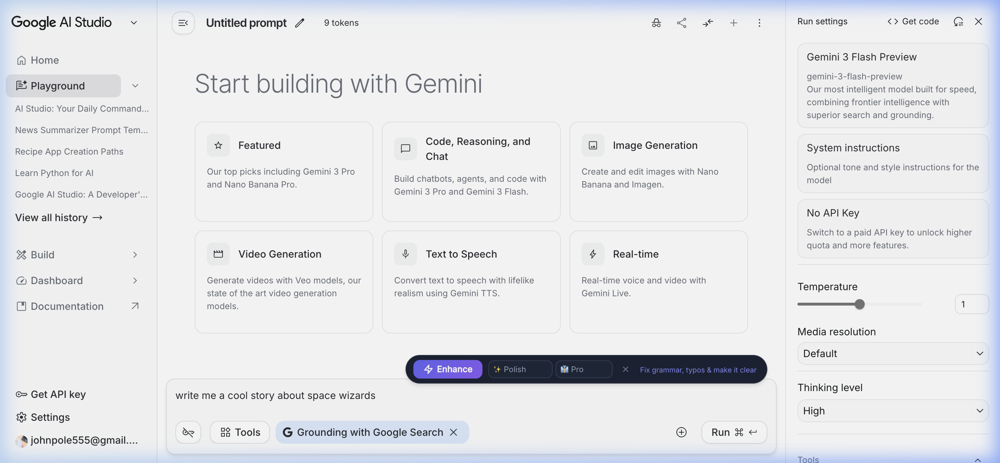
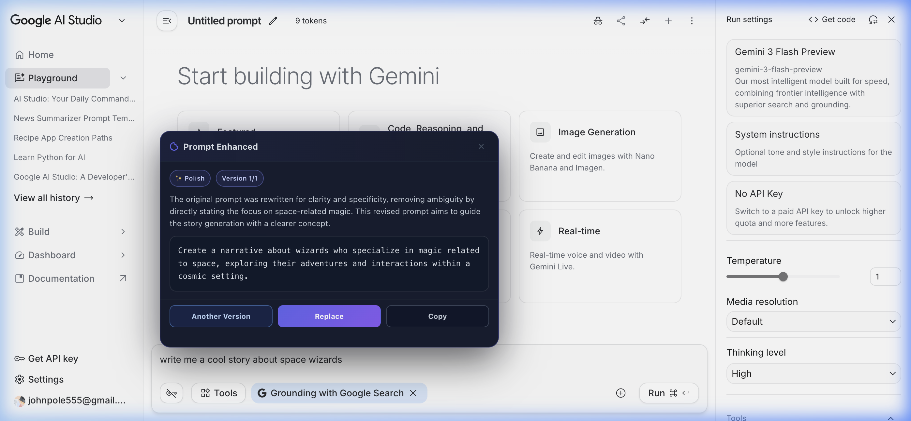

# PromptShift

PromptShift is a Chrome extension that upgrades raw prompts directly where you type.
It injects a floating "Enhance" control into text fields across websites and rewrites your prompt using proven prompt-engineering frameworks.



## Walkthrough
 
 See PromptShift in action! Below is a quick demonstration of PromptShift running inside Google AI Studio.
 
 1. **Type your raw idea**: Simply type out a rough prompt you want to improve, and the PromptShift extension will appear.
 
 
 2. **Enhance in one click**: After clicking the **Enhance** button, PromptShift will give you an expertly structured, framework-backed rewrite to get the best responses out of the AI.
 
 
## Features

- Works in `textarea`, text `input`, and `contenteditable` fields across websites.
- One-click prompt enhancement powered by your choice of Groq or Gemini.
- Multiple enhancement strategies, including:
  - Polish
  - Email
  - Chat
  - Structured Output
  - Persona
  - CO-STAR
  - Chain of Thought
  - Socratic
  - Agentic
- Tone controls (Professional, Friendly, Casual, Direct, Confident, Empathetic).
- Keyboard shortcuts:
  - Enhance: `Ctrl+Shift+E` (`Cmd+Shift+E` on macOS)
  - Show/Hide pill: `Ctrl+Shift+Y` (`Cmd+Shift+Y` on macOS)
- Remembers selected framework and tone in Chrome local storage.

## Tech Stack

- React + TypeScript + Vite
- Chrome Extension Manifest V3
- Service worker + content script architecture
- Supports both **Groq API** (`llama-3.3-70b-versatile`) and **Gemini API** (`gemini-2.0-flash-lite`) via REST

## Prerequisites

- Node.js 18+
- npm
- A [Groq API key](https://console.groq.com/keys) or a [Google Gemini API key](https://aistudio.google.com).

## Local Setup

1. Install dependencies:

```bash
npm install
```

2. Create `.env.local` in the project root:

```env
# You can provide either or both keys.
# If both are provided, Groq will be prioritized.
GROQ_API_KEY=YOUR_GROQ_API_KEY_HERE
GEMINI_API_KEY=YOUR_GEMINI_API_KEY_HERE
```

3. Build the extension:

```bash
npm run build
```

## Load the Extension in Chrome

1. Open `chrome://extensions`.
2. Enable **Developer mode**.
3. Click **Load unpacked**.
4. Select the `dist/` folder.

The extension icon is configured in `manifest.json` and generated from files in `assets/icons/`.

## Scripts

- `npm run dev`: Runs Vite dev server for the popup app UI.
- `npm run build`: Builds popup + content script + service worker, and copies extension assets to `dist/`.
- `npm run preview`: Previews the built popup app.

## Project Structure

- `src/content.ts`: Injected script for in-page UI and enhancement flow.
- `src/service_worker.ts`: Background worker that calls the configured AI API.
- `src/content.css`: Styling for injected UI.
- `manifest.json`: Chrome extension configuration.
- `assets/icons/`: Extension icons used by Chrome.

## Icon Assets

- `assets/icons/logo-1024.png`: Compressed source logo.
- `assets/icons/icon16.png`
- `assets/icons/icon32.png`
- `assets/icons/icon48.png`
- `assets/icons/icon128.png`

Chrome uses these icon files for the extension entry and toolbar display.

## Security Notes

- Never commit real API keys.
- Keep secrets in `.env.local` only.
- Restrict your API keys when possible.

## Troubleshooting

- If you reload the extension, refresh any open tabs where you expect PromptShift to run.
- If enhancement fails, confirm `GROQ_API_KEY` or `GEMINI_API_KEY` is set and run `npm run build` again.
- If you hit rate limits, wait briefly and retry.

## License

MIT
