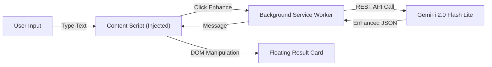

# ⚡ PromptShift — GDG Presentation Edition

**Enhance your AI prompts directly in the browser using the Gemini 2.0 Flash Lite API.**

PromptShift is a Chrome Extension that injects a smart "enhancement layer" into any web-based LLM interface (ChatGPT, Claude, Gemini, etc.). It helps engineers write better prompts by automatically applying proven prompt engineering frameworks.

---

## 🎤 The Problem
"Prompt Engineering" is the new coding, but most of us are bad at it.
- **Lazy Prompts:** "Write a react component" → mediocre code.
- **Context Switching:** Copy-pasting into a "Prompt Optimizer" tool breaks flow.
- **Framework Complexity:** Remembering CO-STAR or Chain-of-Thought structures is hard.

## 💡 The Solution: Inline Enhancement
PromptShift brings the optimization **to you**.
1. Type a command in ANY text input: *"build me a user api"*
2. Click **Enhance** (or `Cmd+Shift+E`)
3. Select a framework (Polish, Agentic, CO-STAR)
4. Watch it transform into a perfect, structured prompt instantly.

---

## 🛠️ Technical Architecture

PromptShift is built on the **Chrome Extension Manifest V3** architecture.

### 1. The Tech Stack
- **Frontend**: React 18 + TypeScript + Vite
- **Styling**: Vanilla CSS (Glassmorphism design)
- **AI Model**: **Google Gemini 2.0 Flash Lite** (via REST API)
- **Build System**: Vite with multi-entry build (Popup, Content Script, Service Worker)

### 2. How It Works (The Data Flow)


- **Content Script (`content.ts`)**: Injects the floating UI into the DOM of *any* webpage. It watches for input events but cannot make API calls directly (CORS).
- **Service Worker (`service_worker.ts`)**: The "backend" of the extension. It holds the API key securely and proxies requests to Gemini. It also handles **Retry Logic** for rate limits.
- **System Prompts**: The secret sauce. We don't just ask Gemini to "fix it" — we use strict System Instructions.

---

## 🧠 Prompt Engineering Frameworks (The "Secret Sauce")

PromptShift doesn't just "rewrite" text; it applies specific **mental models**. You can explain these in your talk:

### 1. ✨ Polish (Clean Up)
*   **Goal:** Clarity and grammar.
*   **Use Case:** Quick emails, Slack messages, simple questions.
*   **System Instruction:** *"Focus only on clarity, grammar, and removing ambiguity. Keep it simple."*

### 2. 📋 Structured Output
*   **Goal:** Force the AI to return data, not chat.
*   **Use Case:** Generating JSON for code, CSV data, or markdown tables.
*   **System Instruction:** *"Define the output format (JSON, Markdown table). Create a schema if needed."*

### 3. ⭐ CO-STAR Framework (Advanced)
*   **Goal:** The industry standard for high-quality generation.
*   **Structure:**
    *   **C**ontext (Who/What)
    *   **O**bjective (Goal)
    *   **S**tyle (Voice)
    *   **T**one (Professional/Casual)
    *   **A**udience (Who is reading?)
    *   **R**esponse Format (Code/Text)

### 4. 🤖 Agentic (Most Advanced)
*   **Goal:** Simulate an autonomous agent.
*   **Use Case:** Complex coding tasks, architecture design.
*   **Structure:** `# ROLE`, `# OBJECTIVE`, `# TOOLS`, `# EXECUTION PLAN`, `# CONSTRAINTS`.

---

## 🚀 Installation & Developer Setup

### Prerequisites
- Node.js 18+
- Google Gemini API Key (Get one at [aistudio.google.com](https://aistudio.google.com))

### 1. Clone & Install
```bash
git clone https://github.com/yourusername/promptshift.git
cd promptshift
npm install
```

### 2. Configure Environment
Create a `.env.local` file in the root:
```env
# Get this from https://aistudio.google.com/apikey
GEMINI_API_KEY=AIzaSy...
```

### 3. Build the Extension
```bash
npm run build
```
*This generates a `dist/` folder with the compiled extension.*

### 4. Load into Chrome
1. Go to `chrome://extensions`
2. Toggle **Developer Mode** (top right) ON.
3. Click **Load Unpacked**.
4. Select the `dist/` folder.

---

## ⚠️ Troubleshooting Tips (Live Demo Survival Guide)

*   **"Extension context invalidated"**: You reloaded the extension but didn't refresh the webpage. **Refresh the tab!**
*   **429 Error**: You hit the rate limit. (Unlikely with Pro, but possible on Free tier). Wait 1 minute.
*   **Nothing happens**: Ensure you typed at least 3 characters. The pill is smart and hides on empty inputs.

---

**Built with ❤️ for the Google Developer Group community.**
